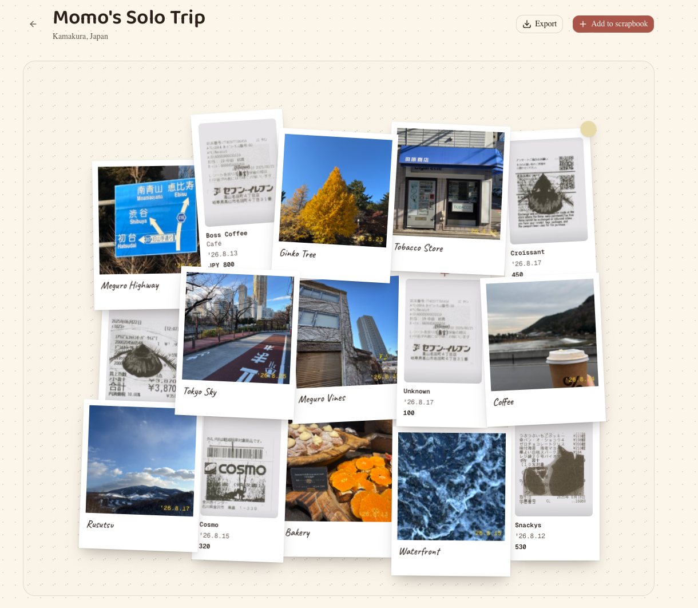

# 🧾 Receipt Scrapbook
This digital scrapbook enables you to interactively create and share your cherished travel memories! 

Inspired by [@kele.zero's twist on travel receipts](https://www.instagram.com/reels/DNDM39QNXYn/), this scrapbook encourages you to save your own travel receipts and incorporate them into your unique scrapbook.

All files uploads are locally stored within your browser & are not stored or uploaded anywhere else.



## ⚡️ Local Start Up

First, run the development server:

```bash
npm run dev
# or
yarn dev
# or
pnpm dev
# or
bun dev
```

Open [http://localhost:3000](http://localhost:3000) with your browser to see the result.

## ✍️ Linting & Typechecking

```bash
 npx eslint src --max-warnings=0  # linting
 ```

 ```bash
 npx tsc --noEmit  # type check
 ```
